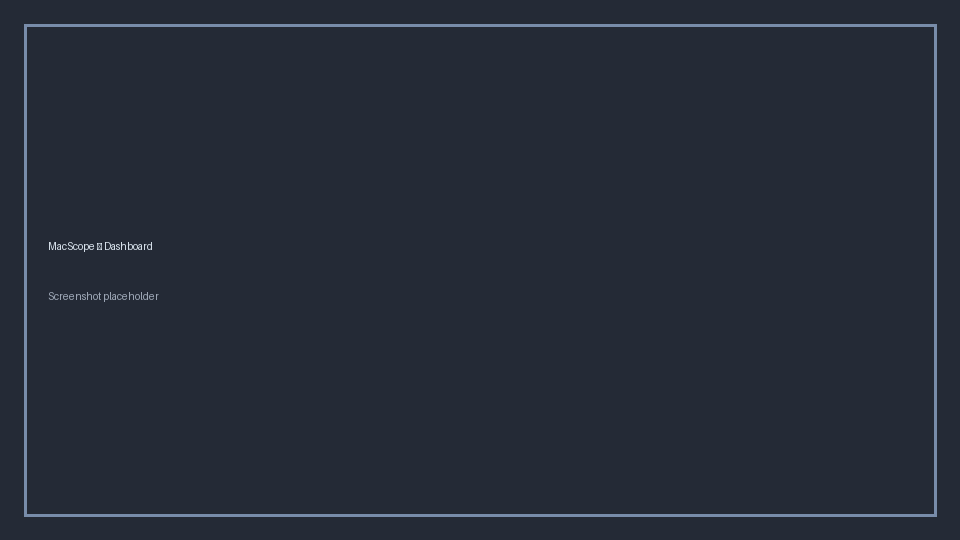
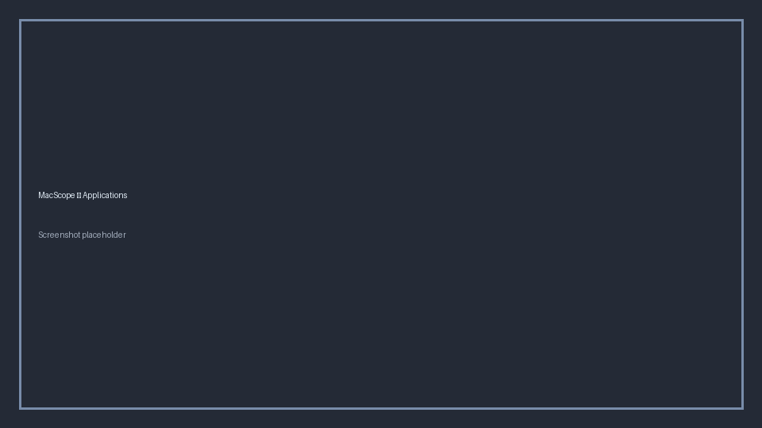
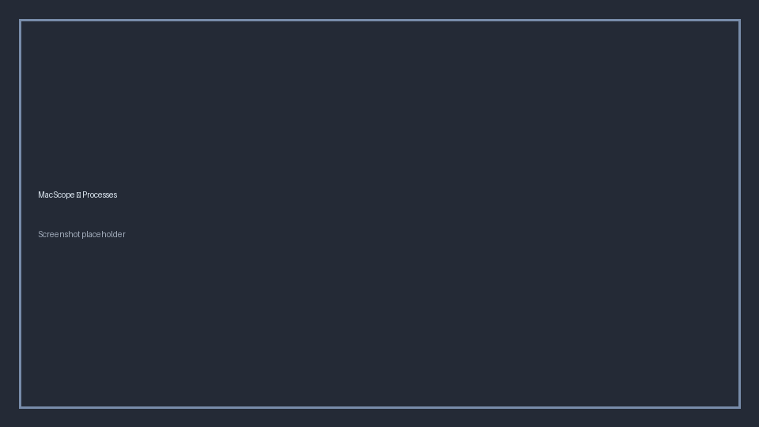
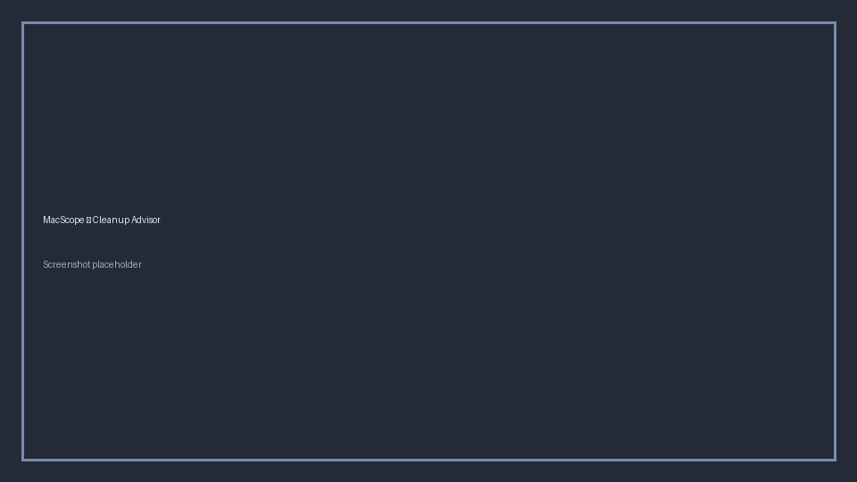
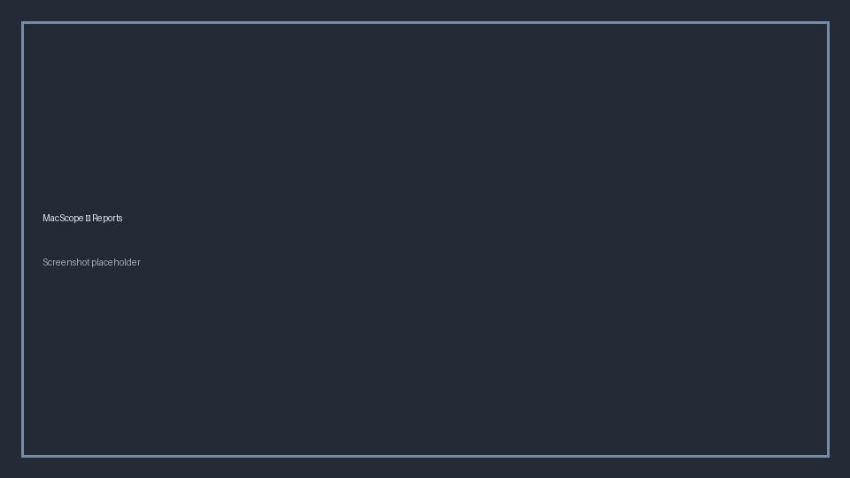
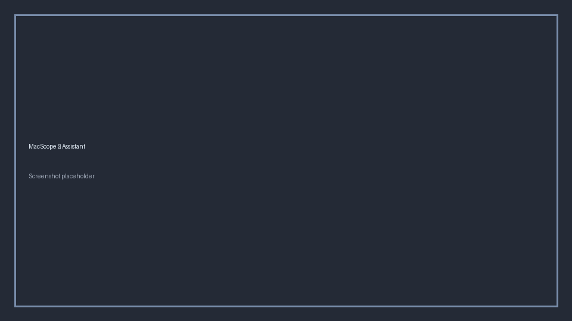

# MacScope User Guide

MacScope helps you understand what is installed and running on your Mac, what starts automatically, how pieces relate, and which cleanup opportunities may exist — with previews, confirmations, and local history.

**Version covered:** 4.0.x

## Before you start

1. Install and launch MacScope (see the [README](../../README.md)).
2. Run a refresh/scan from the Dashboard or inventory pages.
3. Visit **Settings** and read the safety notice before enabling destructive actions.
4. Grant **Full Disk Access** only if you need collectors that read protected databases (login items / some permission views).

MacScope is local-only. Your inventory stays on your Mac under:

```text
~/Library/Application Support/MacScope/
```

## Dashboard

The Dashboard summarizes the latest snapshot: counts, notable signals, and recent activity. Use it as the starting point after each scan.



## Inventory

Inventory pages show categories such as Applications, Processes, LaunchAgents/Daemons, Login Items, Homebrew, Python, Node, Docker, AI models, Network, Storage, and Security.

Typical workflows:

- Filter and sort to find a component
- Inspect path, publisher, size, ports, and related metadata
- Open related actions only after understanding impact
- Favorite / pin / note important items when available





## Projects

**Projects** are first-class objects. MacScope discovers git branch/status/last commit, README/license/requirements, package files, size, recent activity, Docker Compose, environments, ports, LaunchAgents, and Homebrew services linked by path.

You can add **custom project roots** in Settings and **pin** projects so they remain visible.


## Workspaces

A **Workspace** is a complete development environment you define: apps, projects, URLs, terminal commands, venvs, Docker services, Homebrew services, ports, AI servers, and startup scripts.

Use **Start / Stop / Restart Workspace** to manage only assigned members. MacScope will not stop unrelated software. Check **Workspace Status** and **Health** after changes.

## Developer Dashboard

Summarizes projects, repositories/branches, containers, databases, virtual environments, AI servers, ports, storage, and workspace health for day-to-day development oversight.

## Timeline

**System Timeline** records inventory changes and management actions over time — installs/removals/updates, startup/security changes, Homebrew/Docker/Python/AI/network changes, and actions you take inside MacScope.

Use Timeline to answer “what changed?” without guessing.


## Cleanup

Two related tools help with cleanup:

1. **Cleanup Review** — preview related files / candidates before acting
2. **Cleanup Advisor** — recommendations with reason, estimated reclaim, confidence, risk, and suggested action

Treat Advisor output as guidance, not certainty. Always preview before deleting.



## Snapshots

Snapshots store point-in-time inventory. Compare snapshots to see what appeared, disappeared, or changed. Timeline events are informed by these deltas.

Tips:

- Snapshot after major installs or before large cleanups
- Keep enough history to investigate regressions
- Snapshot data remains local

## Reports

Generate HTML/CSV/JSON/Markdown reports from a snapshot. Redaction options help when sharing with another admin. Reports are written under Application Support `reports/` (openable from Tools / Reports UI).



## Assistant

The Assistant answers questions using **only** local inventory and timeline facts, for example:

- What is using memory?
- Why is this LaunchAgent here?
- What changed yesterday?
- Can I uninstall Docker? (answered from local facts + knowledge metadata — not invented claims)

If MacScope does not know, it should say so. It never calls a cloud AI for answers.



## Storage Explorer

Browse storage buckets (Applications, AI Models, Python, Node, Docker, Caches, Downloads, Desktop, Documents, Other) with drill-down and treemap-style visualization when available.


## Settings

Settings control safety gates and preferences:

- Acknowledge the safety notice before enabling destructive actions
- Review data/export locations
- Adjust project/AI roots when exposed by the UI


## Safe actions

MacScope prefers reversible workflows:

| Practice | Why |
| --- | --- |
| Read Diagnostics when collectors warn | Understand missing permissions/tools |
| Preview cleanup selections | Avoid collateral deletes |
| Prefer Trash | Recoverable mistakes |
| Use Action History restore for backed-up plists | Undo disable/move operations |
| Leave system LaunchDaemons alone unless you know elevation steps | No password storage / no silent root |
| Do not treat “unknown” as malware | MacScope is not an AV engine |

Protected components (for example `launchd`, `WindowServer`, Apple `/System` paths, MacScope itself) remain blocked from unsafe actions.

## Related pages

- Permissions Explorer — TCC-oriented privacy permissions when readable
- Crash History — DiagnosticReports grouped by app
- Updates — detect Homebrew/Node/Docker/Python/LM Studio updates without installing
- Relationships — tree/table graph of component links
- Search — local natural-language inventory queries

## Getting help

- [Troubleshooting](../../README.md#troubleshooting)
- [FAQ](../../README.md#faq)
- [Security policy](../../SECURITY.md)
- GitHub Issues / Discussions
